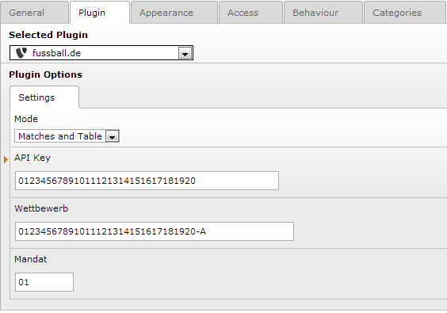

=========================
EXT: fussballde
=========================

Extension Key: fussballde

Language: en

Version: 1.0.0

Keywords: fussball

Copyright 2013, Matthias Gugel, <mail@matthias-gugel.de>

This document is published under the Open Content License available from http://www.opencontent.org/opl.shtml

The content of this document is related to TYPO3 - a GNU/GPL CMS/Framework available from www.typo3.org

Introduction
============

What does it do?
----------------
Shows matches and/or table from fussball.de.

Screenshots
-----------

        Settings

        All settings are required.
